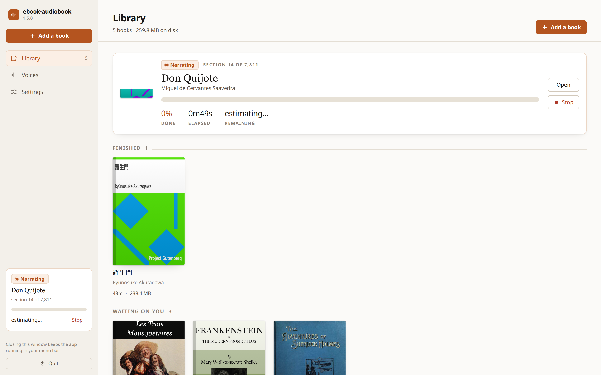
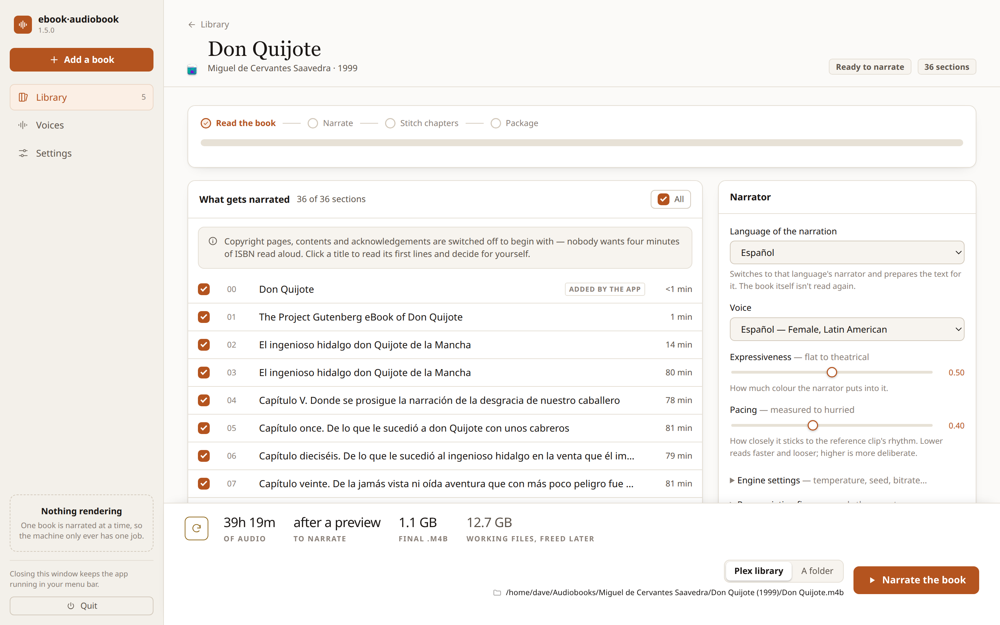
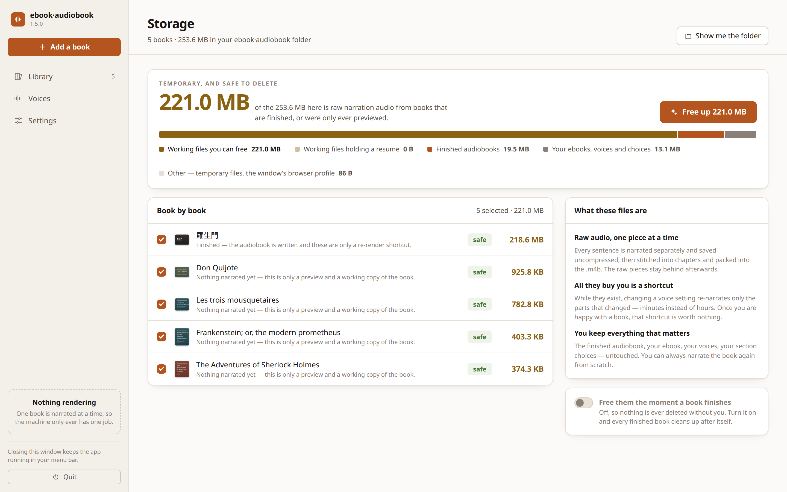

<p align="center">
  
</p>

<h1 align="center">ebook·audiobook</h1>

<p align="center">
  <strong>Turn an ebook you own into a narrated audiobook, entirely on your own machine.</strong><br>
  One chaptered, tagged <code>.m4b</code> per book — filed straight into your Plex library.
</p>

<p align="center">
  <a href="https://github.com/denelson1-dot/ebook-audiobook/releases/latest"></a>
  <a href="https://github.com/denelson1-dot/ebook-audiobook/actions/workflows/ci.yml"></a>
  
  
  <a href="LICENSE"></a>
</p>

<p align="center">
  <a href="#install">Install</a> ·
  <a href="#using-it">Using it</a> ·
  <a href="#listening-to-it">Listening to it</a> ·
  <a href="#how-long-it-takes">How long it takes</a> ·
  <a href="#how-it-works">How it works</a> ·
  <a href="#responsible-use-and-privacy">Privacy</a>
</p>

<p align="center">
  
</p>

No cloud, no account, no telemetry. The voice model runs on your GPU (NVIDIA,
AMD or Apple Silicon) or, more slowly, on the CPU, and nothing you convert ever
leaves the computer.

## Why this one

- **A real audiobook, not a text-to-speech dump.** One `.m4b` per book with a
  chapter marker per chapter, the cover embedded, and the tags Plex and
  Audiobookshelf look for. Filed as `Author / Title (Year) / Title.m4b`.
- **A narrator you'd choose.** Five public-domain voices ship with it, tuned by
  ear. Or clone a rights-cleared clip of your own in about ten seconds of audio.
- **Honest about the hours.** A render takes a while, so the app measures your
  machine, tells you how long, and keeps the progress on every screen. Close the
  window and it carries on in the tray.
- **Nothing is ever lost.** Every sentence is cached by content, so a stopped
  render resumes where it left off and a changed setting re-narrates only what
  changed.
- **It cleans up after itself, on your say-so.** The working audio behind a
  book runs to gigabytes; the app knows which of it is safe to free and which
  is holding a resume, and never deletes either unasked.
- **One command to install**, on Windows, macOS and Linux. It sets up its own
  Python, picks the right PyTorch build for your hardware, and bundles ffmpeg.

## What it looks like

<p align="center">
  
  <br><sub>The book page. What gets narrated on the left, who narrates it on the right, and a bar along the bottom that always says what you are about to commit to.</sub>
</p>

<p align="center">
  
  <br><sub>Storage. Working files that are safe to free, and the ones that would cost hours of narration to lose, told apart.</sub>
</p>

---

## Install

One command. It sets up its own private Python environment, works out which
PyTorch build suits your hardware, and offers to install anything missing.
Nothing is installed system-wide and you don't need administrator rights.

**macOS and Linux**

```bash
curl -fsSL https://github.com/denelson1-dot/ebook-audiobook/releases/latest/download/install-macos-linux.sh | bash
```

**Windows** — open PowerShell and run:

```powershell
irm https://github.com/denelson1-dot/ebook-audiobook/releases/latest/download/install-windows.ps1 | iex
```

Then start it:

```bash
ebook-audiobook
```

That opens the app in its own window — no terminal to leave sitting there, and
no tab lost among your others. You'll also find it in the Start Menu on Windows,
the Applications folder on macOS, and the application menu on Linux.

**Closing the window doesn't stop a render.** The app keeps running in the
system tray so an overnight conversion finishes on its own; open the window
again from the tray or by launching the app a second time. To stop it properly,
use **Quit** — in the tray menu, or at the bottom of the sidebar. Either one
warns you first if a render is still going.

<details>
<summary>What the window actually is, and when the tray isn't there</summary>

The interface is a local web app, shown in a chromeless window borrowed from
whichever Chromium-family browser you have (Chrome, Edge, Brave, Chromium). If
you don't have one, it falls back to a normal tab in your default browser —
Firefox has no equivalent window mode.

The tray icon needs a system tray, and **GNOME doesn't have one** unless you've
installed an AppIndicator shell extension. Without a tray the app still works
and still keeps running after you close the window; you just get it back by
launching it again rather than from a tray icon, and you quit from the sidebar.
Run with `--no-tray` to skip the tray deliberately.

</details>

<details>
<summary>Installer options</summary>

| Option | Effect |
|---|---|
| `--cpu` / `-Cpu` | Force the CPU-only PyTorch build (~400 MB instead of ~4 GB) |
| `--gpu` / `-Gpu` | Force the CUDA build when the GPU probe comes up empty (e.g. a broken `nvidia-smi`) |
| `--rocm` / `--amd` | Force the AMD ROCm build (Linux + Radeon) |
| `--cuda128` / `-Cuda128` | Force the CUDA 12.8 build (RTX 20-series and newer) |
| `--cuda126` / `-Cuda126` | Force the CUDA 12.6 build (GTX 900/1000-series) |
| `--no-tts` / `-NoTts` | Skip PyTorch for now — import books, add the engine later |
| `--version X.Y.Z` | Install a specific release |
| `--dir PATH` / `-InstallDir` | Install somewhere other than the default |
| `--yes` / `-Yes` | Accept all prompts (scripted installs) |
| `--uninstall` / `-Uninstall` | Remove the program, keeping your books and settings |

</details>

### What you need

| | |
|---|---|
| **Python 3.11+** | The installer offers to install it if it's missing |
| **[Calibre](https://calibre-ebook.com/download)** | Required — reads your ebook files. The installer offers to install it |
| **ffmpeg** | **Included.** Nothing to do |
| A GPU | Optional. See [how long it takes](#how-long-it-takes) |

### Uninstalling

```bash
ebook-audiobook-uninstall            # macOS/Linux
```
```powershell
iex "& { $(irm https://github.com/denelson1-dot/ebook-audiobook/releases/latest/download/install-windows.ps1) } -Uninstall"
```

Your books, settings, and finished audiobooks are **never** deleted by an
uninstall. `ebook-audiobook paths` shows you where they live.

---

## Using it

### The app window

Run `ebook-audiobook`, or launch it from your applications menu. Then:

1. **New conversion** → pick a DRM-free ebook from your computer.
2. Choose a **voice** and adjust the settings — expressiveness and pacing up
   front, the finer generation knobs under *Advanced*.
3. **Generate a preview** of any chapter. It uses the exact same engine and
   settings as the full render, so it sounds like the finished article.
4. **Render full audiobook**, and choose where it goes:
   - **Plex library** — filed as a Plex-ready `Author / Title (Year) / Title.m4b`
     tree with a `cover.jpg` beside it. Set the folder once in **Settings**.
   - **A specific folder** — one flat folder you pick.

   Either way the destination is checked for write access *before* the render
   starts, so a bad path fails in a second rather than after three hours.
   There's a **Stop** button, and interrupted renders resume where they left off.
5. The `.m4b` comes out tagged for Plex/Audnexus: marked as an Audiobook
   (`stik=2`), album-artist set to the author, cover embedded, one chapter
   marker per chapter, plus year and ISBN when the ebook provides them.
   ([Not every player shows the chapters](#listening-to-it) — Plex's own don't.)

**Voices** — add your own rights-cleared reference clips, audition them, and
switch between them per book.
**Library** — every conversion you've done, with its status, size, and cleanup
actions.

### The command line

```bash
ebook-audiobook                                   # open the app window
ebook-audiobook web --no-tray                     # ...without a tray icon
ebook-audiobook web --no-browser                  # ...server only, no window
ebook-audiobook check                             # is everything installed?
ebook-audiobook paths                             # where is my data?
ebook-audiobook convert book.epub --preview-seconds 30   # preview, then confirm
ebook-audiobook convert book.epub -y --bitrate 64        # straight through
ebook-audiobook convert book.epub --voice-ref clip.wav   # clone a voice
ebook-audiobook convert book.epub --engine fake -y       # no-GPU plumbing test
ebook-audiobook list                              # past conversions
ebook-audiobook backup ~/books.zip                # back up your work
ebook-audiobook restore ~/books.zip               # put it back
ebook-audiobook update                            # is there a newer release?
ebook-audiobook logs                              # what went wrong recently
ebook-audiobook report                            # that, as a bug report
```

---

## Backing up

```bash
ebook-audiobook backup --dry-run          # what would be included, and how big
ebook-audiobook backup ~/books.zip        # the default: no rendered audio
```

The default leaves rendered audio out, and the difference is not subtle. On a
machine with three books converted:

```
+ settings                   1 files       113 B
+ voice clips                4 files      1.3 MB
+ imported books             5 files     10.4 MB
+ project data              23 files     19.0 MB
- rendered audio         4,637 files      3.3 GB  (excluded)
- finished audiobooks        3 files      5.0 MB  (excluded)

backup size (uncompressed): 30.8 MB in 33 files
left out:                   3.3 GB
```

Rendered audio is content-addressed and reproducible from the book plus your
voice settings, so keeping it costs a hundred times the space to save something
a re-render recreates exactly. The 30 MB is the part that can't be recreated.

| Profile | Contains |
|---|---|
| `--profile settings` | Settings and voice clips. Tiny. |
| `--profile projects` | **Default.** The above, plus your ebooks and every conversion's chaptering, metadata and covers. |
| `--profile full` | Everything above plus rendered audio and finished `.m4b` files. |

Individual switches (`--include-audio`, `--no-imports`, `--include-outputs`,
`--include-models`) override whichever profile you picked, and `--max-size 500MB`
refuses to write anything larger. The installed program's own virtualenv is
never included — it lives under the data folder but it isn't your data.

Restoring never overwrites a file that already exists unless you pass `--force`,
so a restore can't quietly destroy work newer than the backup.

---

## Updates

```bash
ebook-audiobook update            # ask GitHub what the latest release is
ebook-audiobook update --apply    # download and run the official installer
```

Nothing checks for updates on its own. The check is a request to GitHub, and
this app's whole premise is that it doesn't talk to anyone without being asked —
so it happens when you run that command or press the button in **Settings**. The
Settings page has an opt-in to check when it loads; it's off until you turn it on.

Upgrading re-runs the same installer a new user runs, rather than a separate
upgrade path that gets less testing. Your books and settings are untouched.

---

## When something goes wrong

Failures are recorded to a small local log — one line of JSON each, capped at
about 750 KB total, and deleted after two weeks. Nothing is transmitted.

```bash
ebook-audiobook logs              # recent failures
ebook-audiobook report            # a Markdown bug report, ready to file
```

The report includes your version, OS, Python, GPU and the traceback — enough for
someone (or something) to diagnose it without a back-and-forth. Before it's
shown, your home directory is replaced with `~` and book titles are dropped, so
reporting a bug doesn't publish your reading history.

---

## Listening to it

Every book is written with a real chapter marker per chapter, stored **twice** —
as a QuickTime chapter track and as a Nero `chpl` atom — so any player that reads
chapters at all will find them. A render that somehow lost its markers is failed
rather than shipped.

> **Plex Media Server does not read chapters from audio files.** Only from video.
> In Plex and Plexamp your book appears as one unbroken ten-hour track with no
> chapter list and no skip-chapter buttons — which makes the scrub bar genuinely
> hazardous in a car. This is a Plex limitation, not a problem with the file; it
> has been [an open request since 2018][plex-req] with no implementation, and the
> maintainer of the main Plex audiobook guide [says the same][plex-guide].

Use a player that reads the chapters itself. These keep Plex as the library, so
there's no second server to run:

| Platform | Player | Notes |
|---|---|---|
| Android | [Chronicle Epilogue](https://play.google.com/store/apps/details?id=local.oss.chronicle) | Free, [open source](https://github.com/mattttvaughn/chronicle). Chapters, offline downloads, Android Auto, 0.5–3× speed, sleep timer, progress syncs back to Plex. Currently an open beta — join from the Play listing. Needs Android 13+; Android Auto support is basic (no voice control). |
| Android | [Bookcamp](https://play.google.com/store/apps/details?id=app.bookcamp.android) | Chapters, offline, Android Auto — but subscription-only, and reviews report Android Auto and chapter-playback glitches. |
| iOS | [Prologue](https://prologue.audio/) | Chapters, CarPlay (with a chapter list on the now-playing screen), Apple Watch, Siri, bookmarks, sleep timer, voice boost. Free; one-time $5 unlock for offline downloads. Also speaks Audiobookshelf, so it survives a later switch. |
| iOS | [Bookcamp](https://apps.apple.com/us/app/bookcamp/id1523540165) | Chapters, offline, cross-device sync — but subscription-only. |

Not committed to Plex? [Audiobookshelf](https://www.audiobookshelf.org/) reads
these chapters natively on both server and client, and the library tree this tool
writes (`{Author}/{Title} (Year)/`, or `{Author}/{Series}/{NN} - {Title} (Year)/`)
already matches its expected `{Author}/{Series}/{Book}` layout — point it at the
same folder and nothing needs re-rendering.

<details>
<summary>Checking the markers yourself</summary>

If a player shows no chapters, confirm where the fault lies before blaming the
file:

```bash
ffprobe -v error -print_format json -show_chapters "Your Book.m4b" \
  | python3 -c 'import json,sys; print(len(json.load(sys.stdin)["chapters"]))'
```

A number greater than zero means the markers are there and the player is what's
ignoring them.

</details>

[plex-req]: https://forums.plex.tv/t/support-for-reading-chapters-in-m4b-files/741874
[plex-guide]: https://github.com/seanap/Plex-Audiobook-Guide/discussions/92

---

## How long it takes

The model, the weights, and the audio quality are **identical on every device**.
Only the speed changes.

| Your hardware | Runs on | A ~110,000-word novel takes |
|---|---|---|
| NVIDIA GPU, RTX 20-series and newer | CUDA 12.8 | **2–3 hours** (~44 chars/sec on an RTX 3070 Ti) |
| NVIDIA GPU, GTX 900/1000-series | CUDA 12.6 | 2–4 hours |
| AMD Radeon incl. RX 9000 (Linux) | ROCm 6.4 | 3–4 hours |
| Apple Silicon Mac, macOS 12.3+ | Metal | A few hours |
| macOS below 12.3 | CPU | Many hours |
| AMD Radeon (Windows) | CPU | Many hours — PyTorch's ROCm builds are Linux-only |
| No GPU (any OS) | CPU | Many hours — works, but leave it overnight |
| **Intel Mac** | — | **Not supported.** PyTorch stopped building for Intel Macs after 2.2.2. The app installs and everything except rendering works. |

The installer picks the right build for your machine on its own — CUDA, ROCm,
Metal, or CPU-only. `ebook-audiobook check` tells you which one you ended up on
and why. The first segment is slower (warm-up); generating a preview measures
your machine's real rate and refines the estimate shown for the full book.

**NVIDIA** gets CUDA 12.8, which is what RTX 50-series cards need — CUDA 12.4
has no kernels for them at all. Cards older than the RTX 20-series (GTX 900/1000)
aren't in that build, so they get CUDA 12.6 instead; the installer reads your
card's compute capability and picks. On a machine with two GPUs it picks for the
older one, so both keep working. `--cuda126` / `--cuda128` override it, and if
the wrong one ever lands, `ebook-audiobook check` names the flag that fixes it
rather than leaving you with a CUDA error mid-render.

**AMD on Linux** gets the ROCm build automatically when a discrete Radeon is
found. Some consumer cards (RX 6700/6600, RX 7600/7700/7800) aren't on ROCm's
supported list and need `HSA_OVERRIDE_GFX_VERSION` set to be visible at all —
the installer works this out and bakes it into the launcher, so there's nothing
to configure. Integrated Radeon graphics are deliberately left on the CPU build,
which is faster for them than ROCm would be.

**Apple Silicon** is used automatically — there's one Mac build of PyTorch and it
has Metal support built in, so `--cpu` and `--gpu` don't change what's
downloaded. Metal needs macOS 12.3 or newer; below that the same install quietly
runs on the CPU, so the installer says so rather than letting you discover it
from the render time.

### Keeping your computer usable

A full render runs for hours at full tilt. If you want to keep working — or
you're on a laptop that gets hot and loud — turn it down in **Settings**, or per
conversion in the render dialog. The audiobook is byte-for-byte the same job
either way; only the time changes.

| Mode | What it does | Cost |
|---|---|---|
| **Full speed** | Everything available. The default. | — |
| **Balanced** | Caps CPU threads, lowers priority, brief rests | ~10–25% slower |
| **Quiet / background** | Few threads, lowest priority, rests half the time; on Apple Silicon it moves to the **efficiency cores** | ~2x slower |

On the command line: `--power quiet`. The measured chars/sec figure ignores rest
time, so switching modes doesn't make your hardware look slower than it is.

**If a GPU runs out of memory** partway through, the render doesn't die — it
retries once, then moves to the CPU and finishes. Everything already rendered
stays cached either way.

<details>
<summary>Environment variables</summary>

| Variable | Effect |
|---|---|
| `EBAB_DEVICE` | Force `cuda`, `mps`, or `cpu` instead of the automatic choice |
| `EBAB_DATA_ROOT` | Put all stored data somewhere other than the default |
| `EBAB_VERBOSE=1` | Show the engine's own progress bars and warnings |
| `EBAB_PORT` / `EBAB_HOST` | Bind the web UI somewhere other than `127.0.0.1:5005` |
| `EBAB_NO_BROWSER=1` | Don't open a browser window on start |
| `EBAB_EBOOK_CONVERT` | Path to Calibre's `ebook-convert`, for unusual installs |

</details>

---

## How it works

A linear, content-addressed, resumable pipeline:

```
ebook → extract → normalize → chunk  →  render   → assemble → package → .m4b
        (Calibre)  (spoken     (TTS-    (Chatterbox  (ffmpeg)   (ffmpeg,
                    form)       safe)    GPU/CPU/MPS)            chapters+cover)
```

Each segment's identity is `hash(text + voice settings + engine version)`. That
one idea gives you three things for free: an interrupted render **resumes
automatically**, changing a voice setting **re-renders only what changed**, and
changing something that doesn't affect audio (like bitrate) re-renders
**nothing**.

Everything except the TTS engine is pure Python and runs without a GPU. The
`fake` engine renders the whole pipeline to a real `.m4b` for testing.

---

## Where your files live

Everything the app stores lives in one folder — run `ebook-audiobook paths` to
see exactly where. By default:

| OS | Location |
|---|---|
| Windows | `%LOCALAPPDATA%\ebook-audiobook` |
| macOS | `~/Library/Application Support/ebook-audiobook` |
| Linux | `~/.local/share/ebook-audiobook` |

```
imports/          copies of your source ebooks
jobs/             per-book state + cached segment/chapter audio
voices/           your reference clips
outputs/          previews, and finished files when no library folder is set
browser-profile/  the app window's own browser profile (~50 MB, disposable)
settings.json
runtime.json      only while running: which port the app is on
```

Finished audiobooks go to your **Plex library folder** (set in Settings), not
here. Override the whole location with `EBAB_DATA_ROOT=/some/path`.

> Running from a source checkout that already has a `local-data/` folder? That
> keeps working exactly as before — it takes precedence, so an existing setup is
> never orphaned.

### Keeping disk usage down

Narrating a book leaves behind the raw audio of every sentence — several
gigabytes per book, and typically **around 85% of everything this app stores.**
It is kept because it makes a re-render after a settings change take minutes
instead of hours. Once a book sounds right, it is dead weight.

So the figure follows you around. The sidebar carries a running total of what
can safely go, on every screen, and **Storage** breaks it down book by book:

```
7.5 GB   working files you can free
0.8 GB   working files holding a resume
1.4 GB   finished audiobooks
 48 MB   your ebooks, voices and choices
```

The distinction in the first two lines is the one that matters. For a **finished**
book those files buy nothing you can hear, so they are ticked by default. For a
book whose render **stopped part-way**, they *are* the resume — deleting them
means narrating those chapters again — so they are held back, unticked, and the
row tells you what it would cost.

Or stop thinking about it: turn on **Free them when a book finishes** (in
Storage, or in Settings) and each book cleans up after itself the moment its
`.m4b` is written. It is off by default — nothing here deletes anything you
didn't ask it to.

Whatever you free, you keep the finished audiobook, your ebook, your voices and
your section choices, and you can always narrate the book again from scratch.
**Delete** is the other action, and it removes the whole conversion, `.m4b`
included. Previews don't pile up: there's only ever one per book, deleted
automatically once a full render finishes. Nothing can be freed while a book is
being narrated.

---

## Troubleshooting

**"Calibre isn't installed"** — install it from
[calibre-ebook.com](https://calibre-ebook.com/download), or
`winget install calibre.calibre` / `brew install --cask calibre` /
`sudo apt install calibre`. On macOS you do **not** need to add it to your PATH;
the app looks inside `/Applications/calibre.app` itself.

**The `ebook-audiobook` command isn't found** — on macOS/Linux add
`~/.local/bin` to your PATH (the installer tells you the exact line). On Windows,
open a **new** terminal — PATH changes don't affect already-open ones.

**"This book appears to be DRM-protected"** — this tool doesn't remove DRM and
won't open protected files. Bring a DRM-free copy.

**A scanned PDF produces nothing** — an image-only PDF has no text to narrate.
You need an OCR'd or EPUB version.

**Renders are very slow** — check `ebook-audiobook check`. If it says
`device=cpu` and you have an NVIDIA card, the CPU-only PyTorch build got
installed; re-run the installer to get the CUDA one.

Run `ebook-audiobook check` first for anything else — it reports the state of
every prerequisite and how to fix what's missing.

---

## Responsible use and privacy

This tool is for **ebooks you own and are legally allowed to convert**. It does
**not** remove DRM and will not open DRM-protected files. Generated audiobooks
are for **personal use**; converting and redistributing copyrighted work is on
you, not this tool.

Voice cloning from a reference clip is opt-in and local only. Use a voice you
have the **rights and consent** to use — your own, or a rights-cleared clip.
Don't clone someone's voice without their permission.

**Watermarking:** Chatterbox embeds an inaudible
[Resemble Perth](https://github.com/resemble-ai/chatterbox) watermark in all
generated audio so AI-generated speech can be identified after the fact. This is
a deliberate responsible-AI feature and is present in every file this produces.

**Privacy:** everything runs locally. No cloud APIs and no telemetry. Your books,
voice clips, and generated audio never leave the machine. The only network
traffic this app ever makes, in full:

| What | When |
|---|---|
| Downloading the app | Install and upgrade |
| The ~1 GB voice model from Hugging Face | Your first render |
| Asking GitHub for the latest version number | Only when you run `ebook-audiobook update` or press **Check for updates** |

The version check is off by default and never happens on a timer or at start-up.
Turning on "check when this page loads" in Settings is the only way it happens
without you pressing something, and it is opt-in. Nothing about you or your
library is sent with it — it is a request for a version number.

The failure log is local: it is written to your data folder, capped in size,
deleted after two weeks, and never transmitted. `ebook-audiobook report` prints
it for you to share if *you* choose to, with your home directory and book titles
removed.

**Security:** the interface behind the app window has **no authentication** and
binds to `127.0.0.1` deliberately. It's a single-user local tool. Don't expose it
to a network or bind it to `0.0.0.0` — the "import by local path" feature reads
arbitrary local files, so an exposed instance would leak them.

---

## Contributing / running from source

See [CONTRIBUTING.md](CONTRIBUTING.md) for the development setup, the test
suite, and how releases are cut.

## License

[MIT](LICENSE) — free to use, modify, and distribute. Chatterbox is likewise MIT.
The bundled ffmpeg binary (via `imageio-ffmpeg`) is licensed under the GPL by its
own authors; it is invoked as a separate program, not linked into this code.
